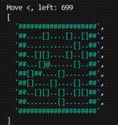

## Day 15: Warehouse Woes

Visit the Advent of Code website for more information on this puzzle at:

**Source:** https://adventofcode.com/2024/day/15 
**Status:** Complete ⭐⭐

 
<i>(Part2 animation from AoC online sample)</i>

## Code

### `robot.ts`

**Robot** class

- Manages the `Robot` object that runs across the grid and moves boxes
- **`findInitialPosition()`** - Finds the robot's initial `Point` position in the 2D grid and stores them in the `this.pos` object
- **`readInstruction()`** - Reads the next instruction and sets the (y,x) direction
- **`walk()`** - Increments the robot's (y,x) coordinate by direction
- **`next()`** - Finds the robot's **next** (y,x) coordinate or a given `Point` parameter using the robot's current direction.
- **`prev()`** - Finds the robot's **previous** (y,x) coordinate or a given `Point` parameter using the robot's current direction.

### `calculateGPS.ts`

- **`moveBoxes()`** - Moves the robot and boxes across the grid
- **`calculateGPS()`** - Calculates the GPS sum of all boxes in the grid

### `calculateExpandedGPS.ts`

- **`moveExpandedBoxes()`** - Moves the robot and the expanded (2x size) boxes across the grid.
- **`calculateExpandedGPS()`** - Calculates the GPS sum of all expanded boxes in the grid.

### `fileReader.ts`

- **`fileReader()`** - Reads and formats the day 15 quiz input file.

### `fileReaderExpanded.ts`

- **`fileReaderExpand()`** - Reads and formats the day 15 - part 2 quiz input file. Expands the tile symbols by 2.

### `utils.ts`

- **`isExpandedBoxSymbol()`** - Checks if the `symbol` parameter is an expanded box symbol `"["` or `"]"`
- **`getBoxStartCoordinates()`** - Retrieves the 2 half-box (y,x) coordinates of a full expanded box - left and right `PointSymbol`
- **`getReverseSymbol()`** - Retrieves the reverse matching symbol of an expanded box symbol
- **`getSymbolDirection()`** - Retrieves the `x` direction associated with an expanded box symbol

## Notes

### Main Objects

1. GRID
   - 2d board array
   - contains
      - blank space: `.`
      - walls: `#`
      - box: `O`
      - amok robot: = `@`

2. WALLS
   - symbol `#`
   - surrounds grid edges
   - found inside grid
   - impassable by: `O`, `@`
   - passable: GPS

3. BOX
   - symbol `O`
   - impassable: `@`, other `O`
   - passable: GPS
   - can be moved up/down/left/right by `@`

4. ROBOT
   - symbol `@`
   - has move instructions
   - can move up/down/left/rigt
   - can push `O`
   - cannot move if blocked by unpushable `O`
   - cannot move if blocked by `#`

### Algo

#### Phase 1 - Move Boxes

- initialize all pos in grid
- read robot move instruction
- turn + move according to instruction
- if symbol ahead is `O`
   - chain pushing preceeding `O`s
   - if `O` unmovable, stop
- if symbol ahead is `.`
   - move
- if symbol ahead is `#`
   - stop
- repeat until end of move instructions

#### Phase 2 - Calculate Box GPS

- for each box,
   - GPS = 100 * distance from top + distance from left
- sum all box GPS
